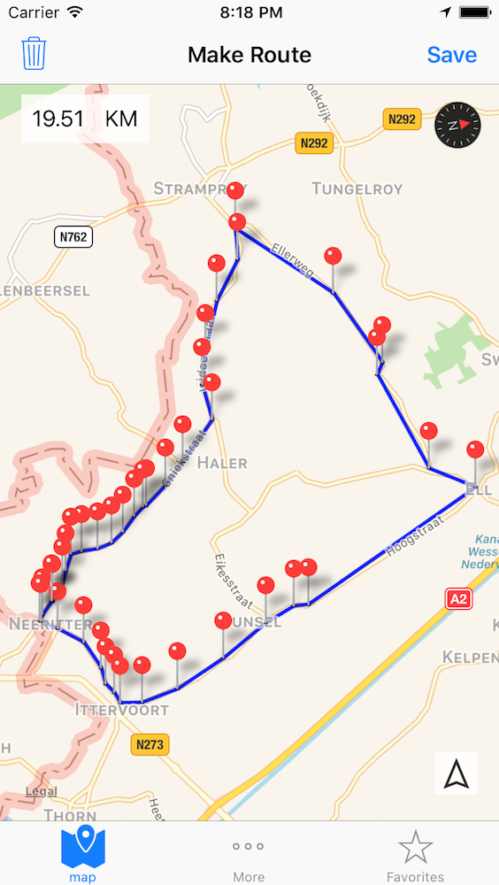
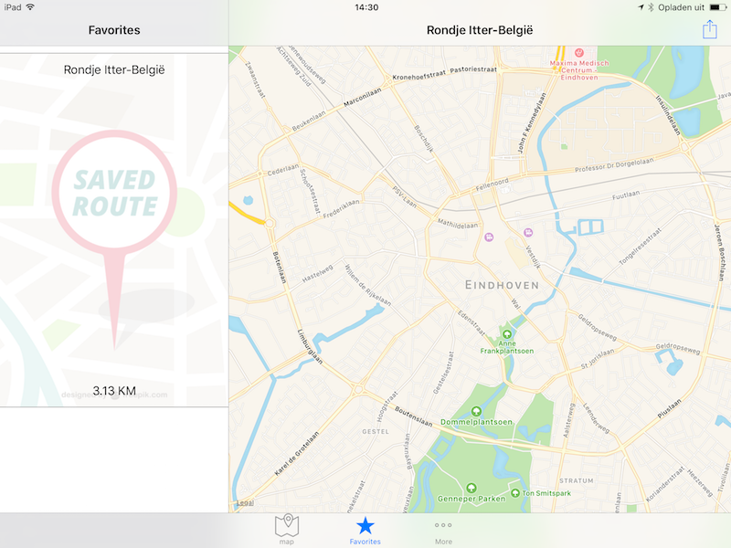
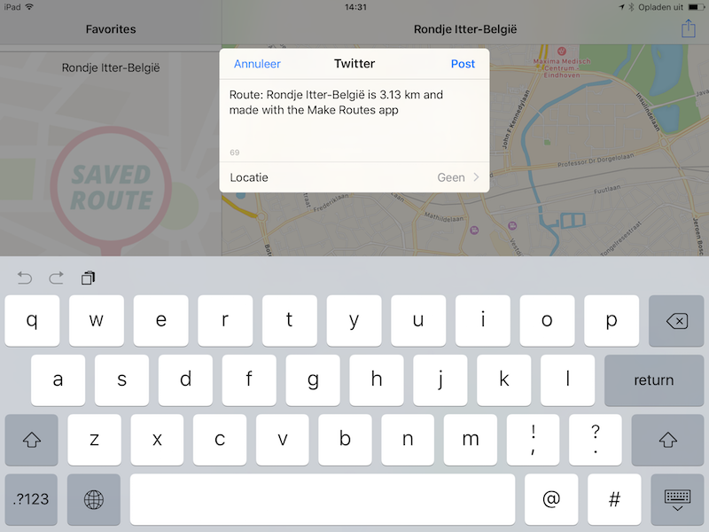
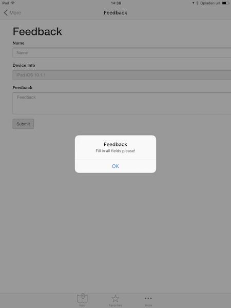

# iOS 7 Logboek
## De app
Ik heb gekozen om de app Make Routes te gaan maken de doel van deze app is dat je m.b.v. een kaartje een route kan uitstippelen. Deze routes moet je kunnen opslaan en later terug kunnen kijken.

## Week 1

Als eerste heb ik heb start project gemaakt. Met een `MKMapView` erin. Hier voeg ik op een `LongPressedGesture` een `MKPointAnnotation` (Marker) toe aan de kaart. 
```swift
let tappedPoint = sender.location(in: self.mapView)
let tappedCoordinate = mapView.convert(tappedPoint, toCoordinateFrom: self.mapView)
let tapMarker = MKPointAnnotation()
tapMarker.coordinate = tappedCoordinate
self.mapView.addAnnotation(tapMarker)

```
Als er meer dan 2 markers op de kaart staan teken in een `MKPolyline` tussen deze markers. Van de route die ontstaat door de geplaatste markers wordt de lengte berekend.




En tot slot heb ik nog een appicon gemaakt voor de app.


## Week 2

Als eerste heb ik de `UIColletionView` en `UISplitView` gemaakt voor het weergeven van de opgeslagen routes.
Aangezien ik al een start project had moest ik de splitview later toevoegen. Deze werkte echter niet wat bleek was dat je in de `AppDelegate` een aantal aanpassingen moest doen. Dit heeft mij  wel even gekost om dit uit te vinden. 



Verder heb ik ook nog socialmedia sharing toegevoegd. Met behulp van `SLServiceTypeTwitter` wordt er een sharing dialog getoond waar een voorafgevulde tekst in staat.



## Week 3
Deze week heb ik nog een Table view toegevoegd dit heb ik deze bevat 2 records. Een die verwijst naar About pagina waar informatie staat wat er voor features geimplementeerd zijn in de app. Ook bevat de table view een feedback view. Deze maakt gebruikt van een webformulier dat op [deze url](https://makeroutes.casperschobers.nl) staat. Met behulp van `javascript` wordt er data aan de `WKWebView` gegeven en wordt er ook een status terug gestuurd bij verzenden van het formulier.



Ook heb ik nog [Realm](http://realm.io) geimplementeerd voor het opslaan van de routes lokaal op het iOS device.
